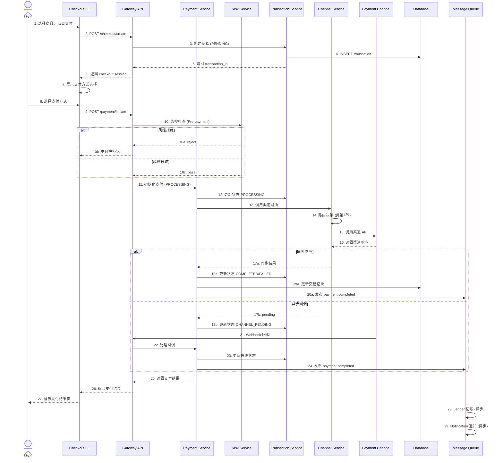

# ADR-025: 交易核心域架构设计

## 状态

- 状态: 草案 📝 (待 review)
- 日期: 2026-02-03
- 决策人: Arch (架构师)
- Reviewers: BE, FE, Infra

---

## 背景

M3 交易核心是 PSP 系统的 P0 关键路径，包含 Transaction、Payment、Risk、Channel 四个核心模块的协作。本 ADR 定义：

1. **交易状态机** - 完整的状态流转和幂等策略
2. **支付流程时序图** - Checkout → Payment → Channel 的数据流
3. **风控拦截点** - Risk 模块的接入点和响应策略
4. **渠道路由策略** - 智能路由的权重算法和 fallback 机制

---

## 1. 交易状态机设计

### 1.1 状态定义

```
                    ┌─────────────┐
                    │   START     │
                    └──────┬──────┘
                           │ create
                           ▼
┌─────────────┐      ┌─────────────┐      ┌─────────────┐
│   EXPIRED   │◄─────│   PENDING   │─────►│  CANCELLED  │
└─────────────┘      └──────┬──────┘      └─────────────┘
     timeout                │ cancel
                            │ pay
                            ▼
                      ┌─────────────┐
         ┌────────────│  PROCESSING │────────────┐
         │            └──────┬──────┘            │
         │ channel invoke    │                   │
         ▼                   │                   │
   ┌─────────────┐           │                   │
   │  CHANNEL    │           │ gateway callback  │
   │  PENDING    │───────────┘                   │
   └──────┬──────┘                               │
          │ channel response                      │
          ▼                                       │
   ┌─────────────┐      ┌─────────────┐          │
   │  SUCCESS    │─────►│  COMPLETED  │◄─────────┘
   └─────────────┘      └─────────────┘
          │
          │ fail
          ▼
   ┌─────────────┐      ┌─────────────┐
   │   FAILED    │─────►│  REFUNDING  │◄───── refund request
   └─────────────┘      └──────┬──────┘
                               │
                               ▼
                        ┌─────────────┐
                        │  REFUNDED   │
                        └─────────────┘
```

### 1.2 状态说明

| 状态 | 说明 | 允许操作 | 持久化 |
|------|------|---------|--------|
| `PENDING` | 待支付，订单已创建 | cancel, pay | ✅ |
| `PROCESSING` | 支付处理中 | - (只读) | ✅ |
| `CHANNEL_PENDING` | 渠道处理中 | - (等待回调) | ✅ |
| `COMPLETED` | 支付成功完成 | refund | ✅ |
| `FAILED` | 支付失败 | retry (重新创建交易) | ✅ |
| `CANCELLED` | 已取消 | - (终态) | ✅ |
| `EXPIRED` | 已过期 | - (终态) | ✅ |
| `REFUNDING` | 退款中 | - (只读) | ✅ |
| `REFUNDED` | 已退款 | - (终态) | ✅ |

### 1.3 幂等策略

```typescript
// 幂等键生成规则
interface IdempotencyKey {
  // 格式: {merchant_id}:{order_id}:{action}
  // 示例: "mer_abc123:ORDER-001:pay"
  key: string;
  
  // TTL: 24小时
  ttl: 86400;
}

// 幂等控制表
interface IdempotencyRecord {
  key: string;           // 幂等键
  status: 'processing' | 'completed' | 'failed';
  response_hash: string; // 响应摘要
  created_at: Date;
  expires_at: Date;
}
```

**幂等规则**:
1. **PENDING → PROCESSING**: 同幂等键 24h 内只能执行一次
2. **PROCESSING 状态**: 同幂等键返回"处理中"，客户端轮询
3. **COMPLETED/FAILED**: 同幂等键返回缓存结果
4. **CANCELLED/EXPIRED**: 允许重新发起（新幂等键）

### 1.4 超时机制

| 阶段 | 超时时间 | 动作 |
|------|---------|------|
| PENDING | 30分钟 | 自动过期 (EXPIRED) |
| PROCESSING | 5分钟 | 查询渠道状态，同步更新 |
| CHANNEL_PENDING | 15分钟 | 标记为 FAILED，异步对账修复 |
| REFUNDING | 24小时 | 异步任务持续重试，告警通知 |

---

## 2. 支付流程时序图

### 2.1 标准支付流程



### 2.2 接口契约

#### 2.2.1 Checkout → Payment 接口

```http
POST /api/v1/payments/initiate
Content-Type: application/json
Idempotency-Key: {merchant_id}:{order_id}:pay

{
  "transaction_id": "txn_xxx",
  "payment_method": "credit_card",
  "payment_provider": "stripe",
  "amount": 999.99,
  "currency": "USD",
  "card_token": "tok_xxx",  // 敏感数据，PCI 要求
  "risk_context": {
    "ip_address": "1.2.3.4",
    "device_id": "dev_xxx",
    "fingerprint": "fp_xxx"
  }
}
```

**响应**:
```json
{
  "code": 0,
  "data": {
    "payment_id": "pay_xxx",
    "status": "processing",
    "transaction_id": "txn_xxx",
    "redirect_url": null,  // 3DS 时需要
    "expected_completion": "2026-02-03T10:35:00Z"
  }
}
```

#### 2.2.2 Payment → Channel 接口

```typescript
interface ChannelRequest {
  channel_code: string;        // 'stripe', 'bradesco', etc.
  amount: Money;
  currency: string;
  reference_id: string;        // 渠道方唯一标识
  callback_url: string;        // 异步回调地址
  metadata: Record<string, any>;
  timeout_ms: number;          // 渠道超时
}

interface ChannelResponse {
  success: boolean;
  channel_order_id: string;
  status: 'success' | 'pending' | 'failed';
  gateway_response: any;       // 渠道原始响应
  requires_3ds?: boolean;      // 是否需要 3DS
  redirect_url?: string;       // 3DS 跳转地址
  error_code?: string;         // 失败时
  error_message?: string;
}
```

---

## 3. 风控拦截点设计

### 3.1 拦截点位置

```
┌─────────────────────────────────────────────────────────────┐
│                     风控拦截点分布                            │
├─────────────────────────────────────────────────────────────┤
│                                                             │
│  [1] Checkout 创建时                                          │
│      └── 用户/设备黑名单检查                                    │
│      └── 频次限制 (同一设备/IP 创建订单数)                       │
│                                                             │
│  [2] 支付发起时 (Pre-payment) ⭐ P0                            │
│      └── 交易风控规则 (金额、时间、地点异常)                     │
│      └── AML 筛查                                             │
│      └── 3DS 强制触发规则                                      │
│                                                             │
│  [3] 渠道路由时 (Pre-channel)                                 │
│      └── 渠道限额检查                                          │
│      └── 渠道风控偏好 (某些渠道拒绝高风险交易)                   │
│                                                             │
│  [4] 支付完成后 (Post-payment)                                │
│      └── 事后风控分析                                          │
│      └── 异常模式标记                                          │
│                                                             │
└─────────────────────────────────────────────────────────────┘
```

### 3.2 Pre-payment 风控详细设计

```typescript
interface RiskCheckRequest {
  transaction_id: string;
  merchant_id: string;
  user_id: string;
  amount: Money;
  payment_method: string;
  context: RiskContext;
}

interface RiskCheckResponse {
  decision: 'APPROVE' | 'REJECT' | 'CHALLENGE' | 'REVIEW';
  score: number;              // 0-100 风险分
  rules_triggered: string[];  // 触发的规则ID
  requires_3ds: boolean;      // 是否强制3DS
  challenge_method?: '3ds' | 'otp' | 'captcha';
}
```

**决策策略**:

| 风险分 | 决策 | 处理 |
|--------|------|------|
| 0-30 | APPROVE | 直接放行 |
| 31-60 | CHALLENGE | 强制 3DS 验证 |
| 61-80 | REVIEW | 进入人工审核队列 |
| 81-100 | REJECT | 直接拒绝 |

### 3.3 风控服务故障处理

参考 ADR-023，采用分层策略：

```typescript
async function riskCheckWithFallback(request: RiskCheckRequest): Promise<RiskCheckResponse> {
  try {
    // 正常调用风控服务
    return await riskService.check(request);
  } catch (error) {
    // 风控服务不可用
    logger.warn('Risk service unavailable, applying fail-closed strategy');
    
    // 核心规则本地检查 (黑名单等)
    const localCheck = await localRiskRules.check(request);
    if (localCheck.isBlacklisted) {
      return { decision: 'REJECT', score: 100, ... };
    }
    
    // 根据环境策略处理
    if (config.ENV === 'production') {
      // 生产环境：进入降级模式，提高 3DS 触发率
      return { 
        decision: 'CHALLENGE', 
        score: 50, 
        requires_3ds: true,
        reason: 'risk_service_degraded' 
      };
    } else {
      // 非生产环境：放行（但记录告警）
      return { 
        decision: 'APPROVE', 
        score: 0,
        reason: 'risk_service_bypass_dev' 
      };
    }
  }
}
```

---

## 4. 渠道路由策略

### 4.1 路由架构

```
┌─────────────────────────────────────────────────────────────┐
│                    智能路由引擎                               │
├─────────────────────────────────────────────────────────────┤
│                                                             │
│  ┌─────────────┐    ┌─────────────┐    ┌─────────────┐     │
│  │   硬性过滤   │───►│   权重评分   │───►│   最终选择   │     │
│  │  (Filters)  │    │  (Scoring)  │    │ (Selection) │     │
│  └─────────────┘    └─────────────┘    └─────────────┘     │
│         │                  │                  │            │
│         ▼                  ▼                  ▼            │
│    • 币种支持            • 成功率评分        • 加权随机      │
│    • 支付方式            • 费率评分          • 优先级兜底   │
│    • 金额范围            • 响应时间评分                       │
│    • 商户配置            • 健康度评分                        │
│    • 熔断状态                                           │
│                                                             │
└─────────────────────────────────────────────────────────────┘
```

### 4.2 路由决策流程

```typescript
interface RoutingRequest {
  merchant_id: string;
  payment_method: string;
  amount: Money;
  currency: string;
  preferred_channel?: string;  // 商户指定偏好
}

interface ChannelScore {
  channel_id: string;
  channel_code: string;
  
  // 硬性条件
  available: boolean;
  currency_supported: boolean;
  method_supported: boolean;
  within_limits: boolean;
  circuit_breaker_open: boolean;
  
  // 权重评分 (0-100)
  success_rate_score: number;   // 成功率权重 40%
  fee_rate_score: number;       // 费率权重 30%
  latency_score: number;        // 响应时间权重 20%
  health_score: number;         // 健康度权重 10%
  
  // 综合评分
  total_score: number;
}

class ChannelRouter {
  async route(request: RoutingRequest): Promise<ChannelSelection> {
    // 1. 获取所有可用渠道
    const channels = await this.getChannelsForMerchant(request.merchant_id);
    
    // 2. 硬性过滤
    const candidates = channels.filter(ch => 
      ch.available &&
      ch.supportsCurrency(request.currency) &&
      ch.supportsMethod(request.payment_method) &&
      ch.isWithinLimits(request.amount) &&
      !this.circuitBreaker.isOpen(ch.id)
    );
    
    if (candidates.length === 0) {
      throw new NoChannelAvailableError('No channel available for this request');
    }
    
    // 3. 计算评分
    const scored = await Promise.all(
      candidates.map(ch => this.scoreChannel(ch, request))
    );
    
    // 4. 排序并选择
    scored.sort((a, b) => b.total_score - a.total_score);
    
    // 5. 加权随机选择 (前3名中随机，避免总是命中同一渠道)
    const top3 = scored.slice(0, 3);
    const selected = this.weightedRandomSelection(top3);
    
    return {
      channel_id: selected.channel_id,
      channel_code: selected.channel_code,
      selection_reason: `score=${selected.total_score.toFixed(2)}`,
      fallback_chain: scored.slice(1, 4).map(s => s.channel_id) // 降级链
    };
  }
  
  private async scoreChannel(channel: Channel, request: RoutingRequest): Promise<ChannelScore> {
    const stats = await this.getChannelStats(channel.id, '1h'); // 近1小时统计
    
    // 成功率评分 (权重40%)
    const successRateScore = stats.success_rate * 100;
    
    // 费率评分 (权重30%) - 费率越低分越高
    const feeRate = channel.getFeeRate(request.currency);
    const feeRateScore = Math.max(0, (1 - feeRate / 0.05) * 100); // 假设5%为基准
    
    // 响应时间评分 (权重20%) - 越快分越高
    const latencyScore = Math.max(0, (500 - stats.avg_latency_ms) / 5);
    
    // 健康度评分 (权重10%)
    const healthScore = channel.health_score;
    
    const totalScore = 
      successRateScore * 0.40 +
      feeRateScore * 0.30 +
      latencyScore * 0.20 +
      healthScore * 0.10;
    
    return { ... /* 组装 ChannelScore */ };
  }
}
```

### 4.3 熔断器机制

```typescript
interface CircuitBreakerConfig {
  failureThreshold: 5;        // 连续失败5次触发熔断
  successThreshold: 3;        // 连续成功3次恢复
  timeoutMs: 30000;           // 熔断持续时间30秒
  halfOpenMaxCalls: 3;        // 半开状态最大测试请求数
}

class ChannelCircuitBreaker {
  private state: 'CLOSED' | 'OPEN' | 'HALF_OPEN' = 'CLOSED';
  private failureCount = 0;
  private successCount = 0;
  private lastFailureTime: Date | null = null;
  
  async execute<T>(fn: () => Promise<T>): Promise<T> {
    if (this.state === 'OPEN') {
      if (Date.now() - this.lastFailureTime!.getTime() > this.config.timeoutMs) {
        this.state = 'HALF_OPEN';
        this.successCount = 0;
      } else {
        throw new CircuitBreakerOpenError('Channel circuit breaker is open');
      }
    }
    
    try {
      const result = await fn();
      this.onSuccess();
      return result;
    } catch (error) {
      this.onFailure();
      throw error;
    }
  }
  
  private onSuccess() {
    this.failureCount = 0;
    if (this.state === 'HALF_OPEN') {
      this.successCount++;
      if (this.successCount >= this.config.successThreshold) {
        this.state = 'CLOSED';
      }
    }
  }
  
  private onFailure() {
    this.failureCount++;
    this.lastFailureTime = new Date();
    if (this.failureCount >= this.config.failureThreshold) {
      this.state = 'OPEN';
    }
  }
}
```

### 4.4 Fallback 策略

```typescript
interface FallbackStrategy {
  // 首选渠道失败后的降级链
  primary: string;
  fallbacks: string[];
  
  // 降级策略
  onFailure: 'immediate' | 'retry_then_fallback' | 'queue_for_retry';
  retryAttempts: number;
  retryDelayMs: number;
}

// 使用示例
async function processPaymentWithFallback(request: PaymentRequest) {
  const routing = await router.route(request);
  const channels = [routing.channel_id, ...routing.fallback_chain];
  
  for (const channelId of channels) {
    try {
      const result = await circuitBreaker.execute(
        () => channelService.process(channelId, request)
      );
      return result;
    } catch (error) {
      logger.warn(`Channel ${channelId} failed, trying fallback`);
      continue;
    }
  }
  
  // 所有渠道都失败
  throw new AllChannelsFailedError('All available channels failed');
}
```

---

## 5. 数据一致性保障

### 5.1 Saga 模式 (长事务)

```
┌─────────────────────────────────────────────────────────────┐
│                    支付 Saga 流程                             │
├─────────────────────────────────────────────────────────────┤
│                                                             │
│  Step 1: 创建交易 (Transaction)                               │
│     ├─► 成功: 继续 Step 2                                    │
│     └─► 失败: Saga 失败，返回错误                             │
│                                                             │
│  Step 2: 风控检查 (Risk)                                      │
│     ├─► 通过: 继续 Step 3                                    │
│     ├─► 拒绝: Saga 失败，更新交易状态                         │
│     └─► 故障: 根据 ADR-023 降级策略处理                        │
│                                                             │
│  Step 3: 渠道调用 (Channel)                                   │
│     ├─► 成功: 继续 Step 4                                    │
│     ├─► 失败: Saga 失败，更新交易状态                         │
│     └─► 超时: 进入异步查询，Saga 挂起                         │
│                                                             │
│  Step 4: 更新交易状态 (Transaction)                           │
│     ├─► 成功: 继续 Step 5                                    │
│     └─► 失败: 补偿操作（通知渠道取消）                        │
│                                                             │
│  Step 5: 异步记账 (Ledger)                                    │
│     └─► 失败重试，不影响 Saga 结果                           │
│                                                             │
└─────────────────────────────────────────────────────────────┘
```

### 5.2 补偿机制

```typescript
interface SagaStep {
  name: string;
  execute: () => Promise<void>;
  compensate?: () => Promise<void>;  // 补偿操作
}

const paymentSaga: SagaStep[] = [
  {
    name: 'create_transaction',
    execute: () => transactionService.create(),
    compensate: () => transactionService.cancel()
  },
  {
    name: 'risk_check',
    execute: () => riskService.check(),
    // 风控无补偿，检查失败直接终止
  },
  {
    name: 'channel_charge',
    execute: () => channelService.charge(),
    compensate: () => channelService.refund()  // 渠道退款
  },
  {
    name: 'update_transaction',
    execute: () => transactionService.complete()
    // 终态无补偿
  }
];
```

---

## 6. 待确认事项

| 事项 | 当前假设 | 需要 BE/FE/Infra 确认 |
|------|---------|---------------------|
| 1 | Transaction 表已包含所有必要字段 | BE 确认 schema 是否匹配状态机 |
| 2 | Risk Service 接口按第3节设计 | BE 确认 Risk 模块当前实现 |
| 3 | 渠道路由权重比例 40/30/20/10 | BE/Infra 确认是否合理 |
| 4 | 幂等键 TTL 24小时 | BE 确认 Redis 配置 |
| 5 | PENDING 超时 30分钟 | FE 确认支付页面倒计时设计 |
| 6 | Temporal 用于异步任务 | Infra 确认部署方案 |
| 7 | 3DS 跳转流程 | FE 确认前端处理方案 |

---

## 7. 实施建议

### 7.1 优先级

| 优先级 | 任务 | 负责人 | 依赖 |
|--------|------|--------|------|
| P0 | 交易状态机实现 | BE | - |
| P0 | 幂等控制机制 | BE | Redis |
| P0 | 基础路由逻辑 | BE | - |
| P1 | 风控拦截点集成 | BE | Risk Service |
| P1 | 熔断器实现 | BE | - |
| P1 | 异步记账 Worker | Infra | Temporal |
| P2 | 智能路由算法优化 | BE | 生产数据 |
| P2 | 路由性能调优 | BE/Infra | 监控数据 |

### 7.2 相关文档

- [Transactions API Spec](./docs/api/03-transactions-api-spec.md)
- [Channels API Spec](./docs/api/04-channels-api-spec.md)
- [ADR-023: Risk Fail-Open Strategy](./ADR-023-risk-fail-open-strategy.md)
- [ADR-024: Batch Refund Spec](./ADR-024-batch-refund-technical-spec.md)

---

*本 ADR 为初稿，待 BE/FE/Infra review 后修订。*
